<div align="center">

# 🏛️ MITCON Credentia

### Secure Legal Document Management & Custody Tracking System

*Built for MITCON Consultancy & Engineering Services Ltd.*

---


</div>

---

## 📋 Table of Contents

1. [Overview & Key Features](#1-overview--key-features)
2. [Tech Stack & Infrastructure](#2-tech-stack--infrastructure)
3. [Business Requirements](#3-business-requirements)
4. [Use Case Diagram](#4-use-case-diagram)
5. [Business Process Flow](#5-business-process-flow)
6. [User Journey](#6-user-journey)
7. [System Context Diagram](#7-system-context-diagram)
8. [High-Level Architecture (HLD)](#8-high-level-architecture-hld)
9. [Component Diagram](#9-component-diagram)
10. [Deployment Diagram](#10-deployment-diagram)
11. [Database ER Diagram](#11-database-er-diagram)
12. [API Architecture & Endpoint Reference](#12-api-architecture--endpoint-reference)
13. [Sequence Diagrams](#13-sequence-diagrams)
14. [Activity Diagrams](#14-activity-diagrams)
15. [State Diagrams](#15-state-diagrams)
16. [Class Diagram](#16-class-diagram)
17. [Data Flow Diagram (DFD)](#17-data-flow-diagram-dfd)
18. [Security Architecture](#18-security-architecture)
19. [Wireframes](#19-wireframes)
20. [UI Flow](#20-ui-flow)
21. [Folder Structure](#21-folder-structure)
22. [User Roles & Access Control](#22-user-roles--access-control)
23. [Authentication & First-Time Login](#23-authentication--first-time-login)
24. [File Storage System](#24-file-storage-system)
25. [Real-Time Notification System](#25-real-time-notification-system)
26. [Local Development Setup](#26-local-development-setup)
27. [Environment Variables Reference](#27-environment-variables-reference)
28. [Deployment Procedures](#28-deployment-procedures)
29. [Potential Risk Factors](#29-potential-risk-factors)
30. [Developer Disclaimer & Declaration](#30-developer-disclaimer--declaration)

---

## 1. Overview & Key Features

**MITCON Credentia** is a secure, enterprise legal document management and custody tracking system developed for MITCON Consultancy & Engineering Services Ltd. It provides a complete digital chain of custody for financial and legal transactions (Loan Agreements, Mortgage Deeds, Guarantees, Pledge Agreements, etc.).

### Key System Features

| Feature | Description |
|---|---|
| 📁 **Legal Transaction Registry** | Register transactions with multiple parties (Borrower, Lender, Guarantor, Trustee) |
| 📄 **Multi-Document Registration** | Attach multiple legal documents per transaction with type, number, category, version |
| 🖨️ **Scanned Copy Archiving** | Upload scanned PDFs, DOCX, images mapped to individual documents by name key |
| 📦 **Physical Custody Tracking** | Track custodian, location, original sets, and status for each physical document |
| ✍️ **Signatory Management** | Manage all signatories per legal document with sign-off status tracking |
| 🔄 **Checkout & Return Workflow** | Track document checkouts with drawn, uploaded, or typed digital signatures |
| 📊 **Audit Reports** | Export CSV and PDF reports for transactions, documents, checkouts, and returns |
| 🔔 **Real-Time Notifications** | Socket.IO-powered live push notifications for key system events |
| 👥 **User Management** | Manage staff accounts with role-based access control (Super-Admin, Admin, Others) |
| 🔐 **Security Policy Engine** | Configure password strength, session timeout, MFA, and max checkout durations |

---

## 2. Tech Stack & Infrastructure

### Frontend
| Component | Technology |
|---|---|
| Framework | React 18 (TypeScript) |
| Build Tool | Vite 8.1.4 |
| Styling | Tailwind CSS |
| Icons | Lucide React |
| Real-Time | Socket.IO Client |
| Signature Capture | HTML5 Canvas |
| HTTP Client | Fetch API (native) |

### Backend
| Component | Technology |
|---|---|
| Runtime | Node.js (ES Modules) |
| Framework | Express.js |
| ORM | Prisma |
| Authentication | JWT (jsonwebtoken) + bcrypt (12 rounds) |
| Real-Time | Socket.IO Server |
| File Storage | Supabase Storage (Admin SDK) |
| Security | Helmet.js, CORS, express-rate-limit |
| Validation | Zod |
| Logging | Winston + Morgan |

### Infrastructure
| Service | Platform |
|---|---|
| Database | Supabase (PostgreSQL) |
| File Storage | Supabase Storage (bucket: `documents`) |
| Backend Hosting | Railway |
| Frontend Hosting | Vercel |
| Source Control | GitHub (branch: `main`) |

---

## 3. Business Requirements

### 3.1 Functional Requirements

| ID | Requirement | Priority | Module |
|---|---|---|---|
| BR-01 | Register legal transactions with multiple parties | HIGH | Legal Doc Manager |
| BR-02 | Support multiple legal documents per transaction | HIGH | Legal Doc Manager |
| BR-03 | Upload scanned copies mapped to individual document names | HIGH | Legal Doc Manager |
| BR-04 | Track physical custody of each document (custodian, location, sets) | HIGH | Legal Doc Manager |
| BR-05 | Manage signatories for each legal document | MEDIUM | Legal Doc Manager |
| BR-06 | Support physical document checkout with digital signature capture | HIGH | Checkout Module |
| BR-07 | Support document return with condition recording | HIGH | Checkout Module |
| BR-08 | Provide exportable audit reports (CSV, PDF) | HIGH | Reports Module |
| BR-09 | Enforce role-based access control (Super-Admin, Admin, Others) | HIGH | Auth / Security |
| BR-10 | Enforce mandatory password change on first login | HIGH | Auth |
| BR-11 | Broadcast real-time notifications for key system events | MEDIUM | Notification System |
| BR-12 | Auto-purge notifications older than 30 minutes | LOW | Notification System |
| BR-13 | Allow Super-Admin to configure security policies | MEDIUM | Security Policy |
| BR-14 | Restrict file uploads to approved formats with 50MB limit | HIGH | Storage |
| BR-15 | Generate time-limited signed URLs for secure file downloads | HIGH | Storage |
| BR-16 | Allow admin to create staff accounts and share temporary passcodes | HIGH | User Management |
| BR-17 | Provide a health check endpoint for infrastructure monitoring | LOW | Infrastructure |

### 3.2 Non-Functional Requirements

| ID | Requirement | Target |
|---|---|---|
| NFR-01 | System uptime | 99.5% |
| NFR-02 | API response time (P95) | < 500ms |
| NFR-03 | Max file upload size | 50 MB |
| NFR-04 | Session token validity | 1 hour (configurable) |
| NFR-05 | Login rate limiting | 5 attempts / 15 min per IP |
| NFR-06 | General API rate limiting | 100 requests / 15 min per IP |
| NFR-07 | Password hashing | bcrypt, 12 rounds |
| NFR-08 | Data in transit | HTTPS (TLS 1.2+) enforced |
| NFR-09 | Notification auto-purge | Every 30 minutes |

---

## 4. Use Case Diagram


```mermaid
graph TB
    subgraph Actors
        SA["🧑‍💼 Super-Admin"]
        AD["👤 Admin"]
        ST["👤 Staff (Others)"]
        SYS["⚙️ System (Scheduler)"]
    end

    subgraph "Authentication & Users"
        UC1["Login to System"]
        UC2["Change Password (First Login)"]
        UC3["Create Staff Account"]
        UC4["Suspend / Activate Account"]
        UC5["Delete User Account"]
        UC6["Configure Security Policy"]
    end

    subgraph "Legal Document Management"
        UC7["Register Transaction"]
        UC8["Add Party to Transaction"]
        UC9["Register Legal Document"]
        UC10["Add Signatory"]
        UC11["Manage Physical Custody"]
        UC12["Upload Scanned Copy"]
        UC13["View / Download Scanned Copy"]
        UC14["Delete Legal Document"]
    end

    subgraph "Checkout & Return"
        UC15["Checkout Physical Document"]
        UC16["Capture Digital Signature"]
        UC17["Record Document Return"]
    end

    subgraph "Reports & Notifications"
        UC18["Generate CSV Report"]
        UC19["Generate PDF Report"]
        UC20["View Notifications"]
        UC21["Mark Notification Read"]
    end

    subgraph "System Tasks"
        UC22["Auto-Purge Expired Notifications"]
        UC23["Health Check Monitoring"]
    end

    SA --> UC1 & UC2 & UC3 & UC4 & UC5 & UC6 & UC7 & UC8 & UC9 & UC10 & UC11 & UC12 & UC13 & UC14 & UC15 & UC16 & UC17 & UC18 & UC19 & UC20 & UC21
    AD --> UC1 & UC2 & UC3 & UC4 & UC7 & UC8 & UC9 & UC10 & UC11 & UC12 & UC13 & UC15 & UC16 & UC17 & UC18 & UC19 & UC20 & UC21
    ST --> UC1 & UC2 & UC7 & UC13 & UC15 & UC16 & UC17 & UC18 & UC20 & UC21
    SYS --> UC22 & UC23
```

---

## 5. Business Process Flow

### 5.1 Legal Document Registration Process

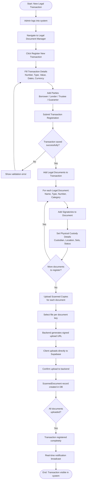
```mermaid
flowchart TD
    A([Start: New Legal Transaction]) --> B[Admin logs into system]
    B --> C[Navigate to Legal Document Manager]
    C --> D[Click Register New Transaction]
    D --> E[Fill Transaction Details\nNumber, Type, Value, Dates, Currency]
    E --> F[Add Parties\nBorrower / Lender / Trustee / Guarantor]
    F --> G[Submit Transaction Registration]
    G --> H{Transaction saved\nsuccessfully?}
    H -- No --> I[Show validation error] --> E
    H -- Yes --> J[Add Legal Documents to Transaction]
    J --> K[For each Legal Document:\nName, Type, Number, Category]
    K --> L[Add Signatories to Document]
    L --> M[Set Physical Custody Details\nCustodian, Location, Sets, Status]
    M --> N{More documents\nto register?}
    N -- Yes --> K
    N -- No --> O[Upload Scanned Copies\nfor each document]
    O --> P[Select file per document key]
    P --> Q[Backend generates signed upload URL]
    Q --> R[Client uploads directly to Supabase]
    R --> S[Confirm upload to backend]
    S --> T[ScannedDocument record created in DB]
    T --> U{All documents\nuploaded?}
    U -- Yes --> V[Transaction registered completely]
    V --> W[Real-time notification broadcast]
    W --> X([End: Transaction visible in system])
```

### 5.2 Document Checkout Process

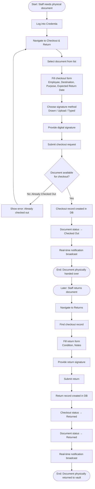
```mermaid
flowchart TD
    A([Start: Staff needs physical document]) --> B[Log into Credentia]
    B --> C[Navigate to Checkout & Return]
    C --> D[Select document from list]
    D --> E[Fill checkout form\nEmployee, Destination, Purpose, Expected Return Date]
    E --> F[Choose signature method\nDrawn / Upload / Typed]
    F --> G[Provide digital signature]
    G --> H[Submit checkout request]
    H --> I{Document available\nfor checkout?}
    I -- No: Already Checked Out --> J[Show error: Already checked out] --> C
    I -- Yes --> K[Checkout record created in DB]
    K --> L[Document status → Checked Out]
    L --> M[Real-time notification broadcast]
    M --> N([End: Document physically handed over])

    N --> O([Later: Staff returns document])
    O --> P[Navigate to Returns]
    P --> Q[Find checkout record]
    Q --> R[Fill return form\nCondition, Notes]
    R --> S[Provide return signature]
    S --> T[Submit return]
    T --> U[Return record created in DB]
    U --> V[Checkout status → Returned]
    V --> W[Document status → Returned]
    W --> X[Real-time notification broadcast]
    X --> Y([End: Document physically returned to vault])
```

---

## 6. User Journey

### 6.1 New Staff Member Journey

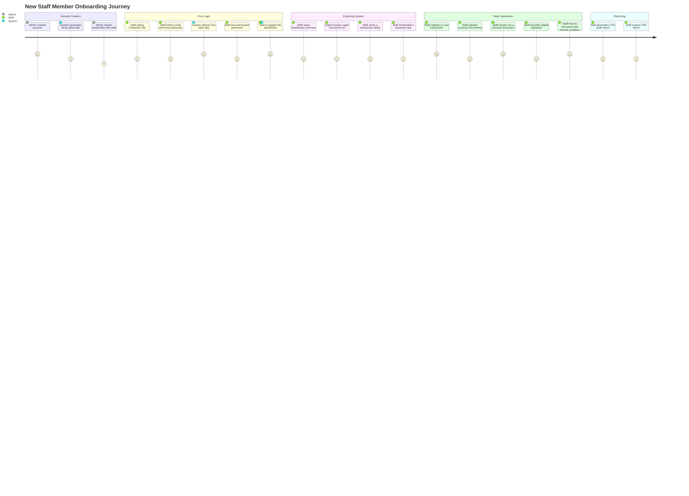
```mermaid
journey
    title New Staff Member Onboarding Journey
    section Account Creation
      Admin creates account: 5: Admin
      System generates temp passcode: 4: System
      Admin shares credentials with staff: 3: Admin
    section First Login
      Staff opens Credentia URL: 4: Staff
      Staff enters email and temp passcode: 4: Staff
      System detects first login flag: 5: System
      Staff sets permanent password: 4: Staff
      Staff is logged into dashboard: 5: Staff, System
    section Exploring System
      Staff views Dashboard overview: 4: Staff
      Staff browses Legal Document list: 4: Staff
      Staff views a transaction detail: 4: Staff
      Staff downloads a scanned copy: 4: Staff
    section Daily Operations
      Staff registers a new transaction: 5: Staff
      Staff uploads scanned documents: 4: Staff
      Staff checks out a physical document: 5: Staff
      Staff provides digital signature: 4: Staff
      Staff returns document and records condition: 5: Staff
    section Reporting
      Staff generates CSV audit report: 4: Staff
      Staff exports PDF report: 4: Staff
```

### 6.2 Admin Journey — User Management

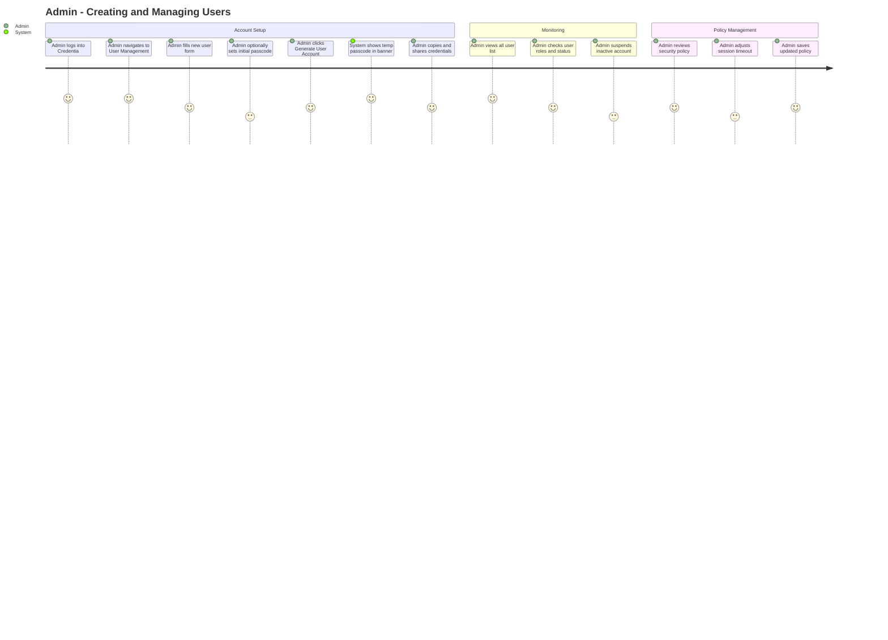
```mermaid
journey
    title Admin - Creating and Managing Users
    section Account Setup
      Admin logs into Credentia: 5: Admin
      Admin navigates to User Management: 5: Admin
      Admin fills new user form: 4: Admin
      Admin optionally sets initial passcode: 3: Admin
      Admin clicks Generate User Account: 4: Admin
      System shows temp passcode in banner: 5: System
      Admin copies and shares credentials: 4: Admin
    section Monitoring
      Admin views all user list: 5: Admin
      Admin checks user roles and status: 4: Admin
      Admin suspends inactive account: 3: Admin
    section Policy Management
      Admin reviews security policy: 4: Admin
      Admin adjusts session timeout: 3: Admin
      Admin saves updated policy: 4: Admin
```

---

## 7. System Context Diagram

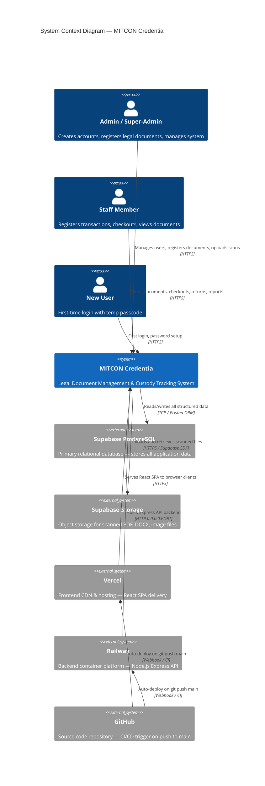
```mermaid
C4Context
    title System Context Diagram — MITCON Credentia

    Person(admin, "Admin / Super-Admin", "Creates accounts, registers legal documents, manages system")
    Person(staff, "Staff Member", "Registers transactions, checkouts, views documents")
    Person(newUser, "New User", "First-time login with temp passcode")

    System(credentia, "MITCON Credentia", "Legal Document Management & Custody Tracking System")

    System_Ext(supabase_db, "Supabase PostgreSQL", "Primary relational database — stores all application data")
    System_Ext(supabase_storage, "Supabase Storage", "Object storage for scanned PDF, DOCX, image files")
    System_Ext(vercel, "Vercel", "Frontend CDN & hosting — React SPA delivery")
    System_Ext(railway, "Railway", "Backend container platform — Node.js Express API")
    System_Ext(github, "GitHub", "Source code repository — CI/CD trigger on push to main")

    Rel(admin, credentia, "Manages users, registers documents, uploads scans", "HTTPS")
    Rel(staff, credentia, "Views documents, checkouts, returns, reports", "HTTPS")
    Rel(newUser, credentia, "First login, password setup", "HTTPS")

    Rel(credentia, supabase_db, "Reads/writes all structured data", "TCP / Prisma ORM")
    Rel(credentia, supabase_storage, "Uploads and retrieves scanned files", "HTTPS / Supabase SDK")
    Rel(vercel, credentia, "Serves React SPA to browser clients", "HTTPS")
    Rel(railway, credentia, "Hosts Express API backend", "HTTP 0.0.0.0:PORT")
    Rel(github, railway, "Auto-deploy on git push main", "Webhook / CI")
    Rel(github, vercel, "Auto-deploy on git push main", "Webhook / CI")
```

---

## 8. High-Level Architecture (HLD)

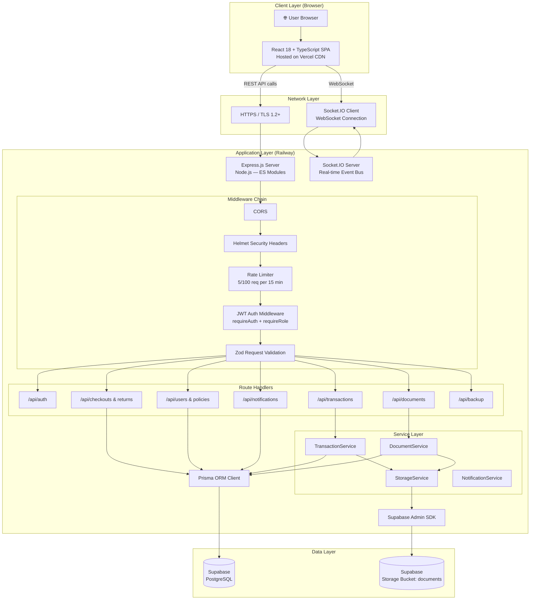
```mermaid
graph TB
    subgraph Client["Client Layer (Browser)"]
        BROWSER["🌐 User Browser"]
        REACT["React 18 + TypeScript SPA\nHosted on Vercel CDN"]
    end

    subgraph Gateway["Network Layer"]
        HTTPS["HTTPS / TLS 1.2+"]
        SOCKETIO_CLIENT["Socket.IO Client\nWebSocket Connection"]
    end

    subgraph Backend["Application Layer (Railway)"]
        EXPRESS["Express.js Server\nNode.js — ES Modules"]
        subgraph Middleware["Middleware Chain"]
            CORS["CORS"]
            HELMET["Helmet Security Headers"]
            RATELIMIT["Rate Limiter\n5/100 req per 15 min"]
            JWT_MW["JWT Auth Middleware\nrequireAuth + requireRole"]
            VALIDATION["Zod Request Validation"]
        end
        subgraph Routes["Route Handlers"]
            AUTH_R["/api/auth"]
            TX_R["/api/transactions"]
            DOC_R["/api/documents"]
            CHKOUT_R["/api/checkouts & returns"]
            NOTIF_R["/api/notifications"]
            SEC_R["/api/users & policies"]
            BACKUP_R["/api/backup"]
        end
        subgraph Services["Service Layer"]
            TX_SVC["TransactionService"]
            DOC_SVC["DocumentService"]
            STORAGE_SVC["StorageService"]
            NOTIF_SVC["NotificationService"]
        end
        SOCKET_SRV["Socket.IO Server\nReal-time Event Bus"]
        PRISMA["Prisma ORM Client"]
        SUPABASE_SDK["Supabase Admin SDK"]
    end

    subgraph Data["Data Layer"]
        SUPABASE_DB[("Supabase\nPostgreSQL")]
        SUPABASE_ST[("Supabase\nStorage Bucket: documents")]
    end

    BROWSER --> REACT
    REACT -- REST API calls --> HTTPS
    REACT -- WebSocket --> SOCKETIO_CLIENT
    HTTPS --> EXPRESS
    SOCKETIO_CLIENT --> SOCKET_SRV
    EXPRESS --> CORS --> HELMET --> RATELIMIT --> JWT_MW --> VALIDATION
    VALIDATION --> AUTH_R & TX_R & DOC_R & CHKOUT_R & NOTIF_R & SEC_R & BACKUP_R
    TX_R --> TX_SVC
    DOC_R --> DOC_SVC
    TX_SVC & DOC_SVC --> STORAGE_SVC --> SUPABASE_SDK
    TX_SVC & DOC_SVC & CHKOUT_R & SEC_R & NOTIF_R --> PRISMA
    PRISMA --> SUPABASE_DB
    SUPABASE_SDK --> SUPABASE_ST
    SOCKET_SRV --> SOCKETIO_CLIENT
```

---

## 9. Component Diagram

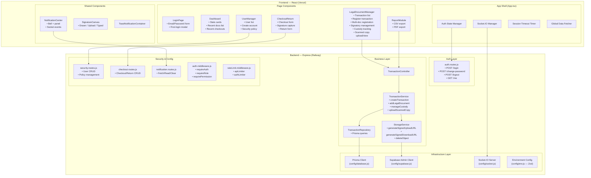
```mermaid
graph TB
    subgraph Frontend["Frontend — React (Vercel)"]
        subgraph AppShell["App Shell (App.tsx)"]
            AUTH_STATE["Auth State Manager"]
            SOCKET_MGR["Socket.IO Manager"]
            SESSION_TIMER["Session Timeout Timer"]
            GLOBAL_FETCH["Global Data Fetcher"]
        end
        subgraph Pages["Page Components"]
            LOGIN["LoginPage\n• Email/Password form\n• First-login modal"]
            DASH["Dashboard\n• Stats cards\n• Recent docs list\n• Recent checkouts"]
            LDM["LegalDocumentManager\n• Transaction list\n• Register transaction\n• Multi-doc registration\n• Signatory management\n• Custody tracking\n• Scanned copy upload/view"]
            CHECKOUT["CheckoutReturn\n• Checkout form\n• Signature capture\n• Return form"]
            REPORT["ReportModule\n• CSV export\n• PDF export"]
            USERS["UserManager\n• User list\n• Create account\n• Security policy"]
        end
        subgraph Shared["Shared Components"]
            NOTIF_CTR["NotificationCenter\n• Bell + panel\n• Socket events"]
            SIG_CANVAS["SignatureCanvas\n• Drawn / Upload / Typed"]
            TOAST["ToastNotificationContainer"]
        end
    end

    subgraph Backend["Backend — Express (Railway)"]
        subgraph AuthLayer["Auth Layer"]
            AUTH_ROUTES["auth.routes.js\n• POST /login\n• POST /change-password\n• POST /logout\n• GET /me"]
        end
        subgraph BusinessLayer["Business Layer"]
            TX_CTRL["TransactionController"]
            TX_SVC2["TransactionService\n• createTransaction\n• addLegalDocument\n• manageCustody\n• uploadScannedCopy"]
            TX_REPO["TransactionRepository\n• Prisma queries"]
            STORAGE2["StorageService\n• generateSignedUploadURL\n• generateSignedDownloadURL\n• deleteObject"]
        end
        subgraph SecurityLayer["Security & Config"]
            SEC_ROUTES["security.routes.js\n• User CRUD\n• Policy management"]
            CHKOUT_ROUTES["checkout.routes.js\n• Checkout/Return CRUD"]
            NOTIF_ROUTES["notification.routes.js\n• Fetch/Read/Clear"]
            AUTH_MW["auth.middleware.js\n• requireAuth\n• requireRole\n• requirePermission"]
            RATE_MW["rateLimit.middleware.js\n• apiLimiter\n• authLimiter"]
        end
        subgraph InfraLayer["Infrastructure Layer"]
            PRISMA_C["Prisma Client\n(config/database.js)"]
            SUPA_C["Supabase Admin Client\n(config/supabase.js)"]
            SOCKET_C["Socket.IO Server\n(config/socket.js)"]
            ENV_C["Environment Config\n(config/env.js — Zod)"]
        end
    end

    AUTH_STATE --> AUTH_ROUTES
    LDM --> TX_CTRL
    TX_CTRL --> TX_SVC2 --> TX_REPO --> PRISMA_C
    TX_SVC2 --> STORAGE2 --> SUPA_C
    SOCKET_MGR --> SOCKET_C
    USERS --> SEC_ROUTES
    CHECKOUT --> CHKOUT_ROUTES
    NOTIF_CTR --> NOTIF_ROUTES
    REPORT --> TX_CTRL
```

---

## 10. Deployment Diagram

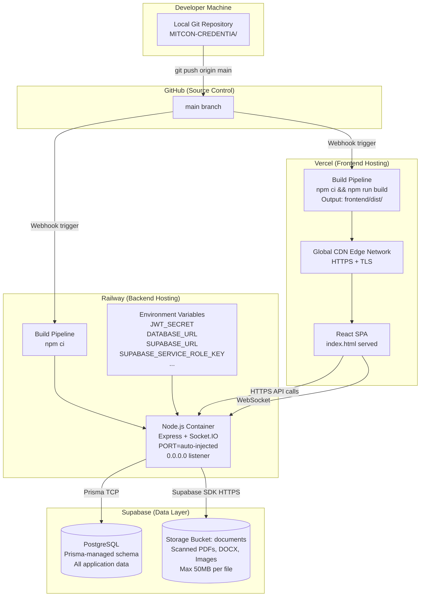
```mermaid
graph TB
    subgraph Developer["Developer Machine"]
        LOCAL_REPO["Local Git Repository\nMITCON-CREDENTIA/"]
    end

    subgraph GitHub["GitHub (Source Control)"]
        MAIN_BRANCH["main branch"]
    end

    subgraph Vercel["Vercel (Frontend Hosting)"]
        VERCEL_BUILD["Build Pipeline\nnpm ci && npm run build\nOutput: frontend/dist/"]
        VERCEL_CDN["Global CDN Edge Network\nHTTPS + TLS"]
        VERCEL_SPA["React SPA\nindex.html served"]
    end

    subgraph Railway["Railway (Backend Hosting)"]
        RAILWAY_BUILD["Build Pipeline\nnpm ci"]
        RAILWAY_CONTAINER["Node.js Container\nExpress + Socket.IO\nPORT=auto-injected\n0.0.0.0 listener"]
        RAILWAY_ENV["Environment Variables\nJWT_SECRET\nDATABASE_URL\nSUPABASE_URL\nSUPABASE_SERVICE_ROLE_KEY\n..."]
    end

    subgraph Supabase["Supabase (Data Layer)"]
        SUPA_PG[("PostgreSQL\nPrisma-managed schema\nAll application data")]
        SUPA_ST[("Storage Bucket: documents\nScanned PDFs, DOCX, Images\nMax 50MB per file")]
    end

    LOCAL_REPO -- git push origin main --> MAIN_BRANCH
    MAIN_BRANCH -- Webhook trigger --> VERCEL_BUILD
    MAIN_BRANCH -- Webhook trigger --> RAILWAY_BUILD
    VERCEL_BUILD --> VERCEL_CDN --> VERCEL_SPA
    RAILWAY_BUILD --> RAILWAY_CONTAINER
    RAILWAY_ENV --> RAILWAY_CONTAINER
    RAILWAY_CONTAINER -- Prisma TCP --> SUPA_PG
    RAILWAY_CONTAINER -- Supabase SDK HTTPS --> SUPA_ST
    VERCEL_SPA -- HTTPS API calls --> RAILWAY_CONTAINER
    VERCEL_SPA -- WebSocket --> RAILWAY_CONTAINER
```

---

## 11. Database ER Diagram

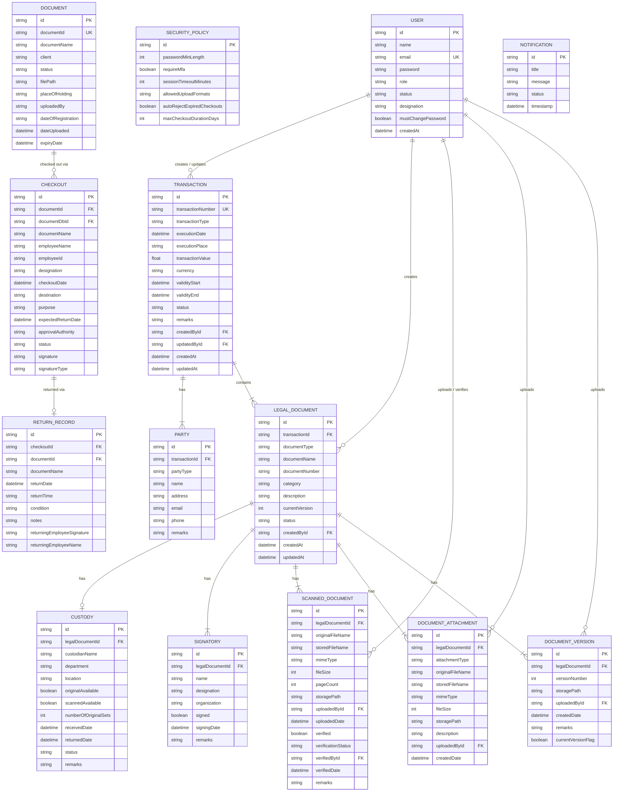
```mermaid
erDiagram
    USER {
        string id PK
        string name
        string email UK
        string password
        string role
        string status
        string designation
        boolean mustChangePassword
        datetime createdAt
    }

    SECURITY_POLICY {
        string id PK
        int passwordMinLength
        boolean requireMfa
        int sessionTimeoutMinutes
        string allowedUploadFormats
        boolean autoRejectExpiredCheckouts
        int maxCheckoutDurationDays
    }

    DOCUMENT {
        string id PK
        string documentId UK
        string documentName
        string client
        string status
        string filePath
        string placeOfHolding
        string uploadedBy
        string dateOfRegistration
        datetime dateUploaded
        datetime expiryDate
    }

    CHECKOUT {
        string id PK
        string documentId FK
        string documentDbId FK
        string documentName
        string employeeName
        string employeeId
        string designation
        datetime checkoutDate
        string destination
        string purpose
        datetime expectedReturnDate
        string approvalAuthority
        string status
        string signature
        string signatureType
    }

    RETURN_RECORD {
        string id PK
        string checkoutId FK
        string documentId FK
        string documentName
        datetime returnDate
        string returnTime
        string condition
        string notes
        string returningEmployeeSignature
        string returningEmployeeName
    }

    NOTIFICATION {
        string id PK
        string title
        string message
        string status
        datetime timestamp
    }

    TRANSACTION {
        string id PK
        string transactionNumber UK
        string transactionType
        datetime executionDate
        string executionPlace
        float transactionValue
        string currency
        datetime validityStart
        datetime validityEnd
        string status
        string remarks
        string createdById FK
        string updatedById FK
        datetime createdAt
        datetime updatedAt
    }

    PARTY {
        string id PK
        string transactionId FK
        string partyType
        string name
        string address
        string email
        string phone
        string remarks
    }

    LEGAL_DOCUMENT {
        string id PK
        string transactionId FK
        string documentType
        string documentName
        string documentNumber
        string category
        string description
        int currentVersion
        string status
        string createdById FK
        datetime createdAt
        datetime updatedAt
    }

    SIGNATORY {
        string id PK
        string legalDocumentId FK
        string name
        string designation
        string organization
        boolean signed
        datetime signingDate
        string remarks
    }

    CUSTODY {
        string id PK
        string legalDocumentId FK
        string custodianName
        string department
        string location
        boolean originalAvailable
        boolean scannedAvailable
        int numberOfOriginalSets
        datetime receivedDate
        datetime returnedDate
        string status
        string remarks
    }

    SCANNED_DOCUMENT {
        string id PK
        string legalDocumentId FK
        string originalFileName
        string storedFileName
        string mimeType
        int fileSize
        int pageCount
        string storagePath
        string uploadedById FK
        datetime uploadedDate
        boolean verified
        string verificationStatus
        string verifiedById FK
        datetime verifiedDate
        string remarks
    }

    DOCUMENT_ATTACHMENT {
        string id PK
        string legalDocumentId FK
        string attachmentType
        string originalFileName
        string storedFileName
        string mimeType
        int fileSize
        string storagePath
        string description
        string uploadedById FK
        datetime createdDate
    }

    DOCUMENT_VERSION {
        string id PK
        string legalDocumentId FK
        int versionNumber
        string storagePath
        string uploadedById FK
        datetime createdDate
        string remarks
        boolean currentVersionFlag
    }

    USER ||--o{ TRANSACTION : "creates / updates"
    USER ||--o{ LEGAL_DOCUMENT : "creates"
    USER ||--o{ SCANNED_DOCUMENT : "uploads / verifies"
    USER ||--o{ DOCUMENT_ATTACHMENT : "uploads"
    USER ||--o{ DOCUMENT_VERSION : "uploads"

    TRANSACTION ||--|{ PARTY : "has"
    TRANSACTION ||--|{ LEGAL_DOCUMENT : "contains"

    LEGAL_DOCUMENT ||--o| CUSTODY : "has"
    LEGAL_DOCUMENT ||--|{ SIGNATORY : "has"
    LEGAL_DOCUMENT ||--|{ SCANNED_DOCUMENT : "has"
    LEGAL_DOCUMENT ||--|{ DOCUMENT_ATTACHMENT : "has"
    LEGAL_DOCUMENT ||--|{ DOCUMENT_VERSION : "has"

    DOCUMENT ||--o{ CHECKOUT : "checked out via"
    CHECKOUT ||--o| RETURN_RECORD : "returned via"
```

---

## 12. API Architecture & Endpoint Reference

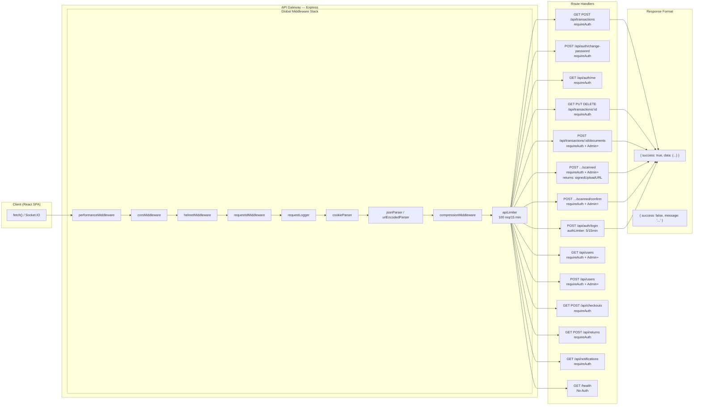
```mermaid
graph LR
    subgraph Client["Client (React SPA)"]
        FETCH["fetch() / Socket.IO"]
    end

    subgraph Gateway["API Gateway — Express"]
        subgraph MW["Global Middleware Stack"]
            M1["performanceMiddleware"]
            M2["corsMiddleware"]
            M3["helmetMiddleware"]
            M4["requestIdMiddleware"]
            M5["requestLogger"]
            M6["cookieParser"]
            M7["jsonParser / urlEncodedParser"]
            M8["compressionMiddleware"]
            M9["apiLimiter\n100 req/15 min"]
        end
    end

    subgraph Routers["Route Handlers"]
        R1["POST /api/auth/login\nauthLimiter: 5/15min"]
        R2["POST /api/auth/change-password\nrequireAuth"]
        R3["GET /api/auth/me\nrequireAuth"]
        R4["GET POST /api/transactions\nrequireAuth"]
        R5["GET PUT DELETE /api/transactions/:id\nrequireAuth"]
        R6["POST /api/transactions/:id/documents\nrequireAuth + Admin+"]
        R7["POST .../scanned\nrequireAuth + Admin+\nreturns: signedUploadURL"]
        R8["POST .../scanned/confirm\nrequireAuth + Admin+"]
        R9["GET /api/users\nrequireAuth + Admin+"]
        R10["POST /api/users\nrequireAuth + Admin+"]
        R11["GET POST /api/checkouts\nrequireAuth"]
        R12["GET POST /api/returns\nrequireAuth"]
        R13["GET /api/notifications\nrequireAuth"]
        R14["GET /health\nNo Auth"]
    end

    FETCH --> M1 --> M2 --> M3 --> M4 --> M5 --> M6 --> M7 --> M8 --> M9
    M9 --> R1 & R2 & R3 & R4 & R5 & R6 & R7 & R8 & R9 & R10 & R11 & R12 & R13 & R14

    subgraph Response["Response Format"]
        SUCCESS["{ success: true, data: {...} }"]
        ERROR["{ success: false, message: '...' }"]
    end

    R4 & R5 & R6 & R7 & R8 --> SUCCESS
    R1 --> SUCCESS
```

### Complete API Endpoint Table

<details>
<summary><strong>🔑 Authentication — /api/auth</strong></summary>

| Method | Endpoint | Auth | Description |
|---|---|---|---|
| `POST` | `/api/auth/login` | None | Login. Returns JWT + user. Rate-limited: 5 req/15 min |
| `POST` | `/api/auth/change-password` | JWT | Mandatory password change on first login |
| `POST` | `/api/auth/logout` | JWT | Invalidate session |
| `GET` | `/api/auth/me` | JWT | Return authenticated user profile |

</details>

<details>
<summary><strong>👤 Users & Security — /api/users, /api/policies</strong></summary>

| Method | Endpoint | Auth | Description |
|---|---|---|---|
| `GET` | `/api/users` | Admin+ | List all user accounts |
| `POST` | `/api/users` | Admin+ | Create new account — returns `temporaryPassword` |
| `DELETE` | `/api/users/:id` | Super-Admin | Delete user (cannot self-delete) |
| `PATCH` | `/api/users/:id/status` | Admin+ | Suspend or activate account |
| `GET` | `/api/policies` | Any Auth | Read security policy |
| `PUT` | `/api/policies` | Super-Admin | Update security policy |

</details>

<details>
<summary><strong>📋 Legal Transactions — /api/transactions</strong></summary>

| Method | Endpoint | Auth | Description |
|---|---|---|---|
| `GET` | `/api/transactions` | Any Auth | List transactions (paginated) |
| `POST` | `/api/transactions` | Any Auth | Register new transaction |
| `GET` | `/api/transactions/:id` | Any Auth | Full transaction details + documents + parties |
| `PUT` | `/api/transactions/:id` | Any Auth | Update transaction metadata |
| `DELETE` | `/api/transactions/:id` | Any Auth | Delete transaction |
| `POST` | `/api/transactions/:id/documents` | Any Auth | Add legal document to transaction |
| `POST` | `.../:id/documents/:docId/scanned` | Any Auth | Generate signed upload URL for scanned file |
| `POST` | `.../:id/documents/:docId/scanned/confirm` | Any Auth | Confirm scanned document upload |
| `GET` | `.../:id/documents/:docId/scanned/:fileId/url` | Any Auth | Get signed download URL for scanned file |
| `DELETE` | `.../:id/documents/:docId/scanned/:fileId` | Admin+ | Delete scanned document |

</details>

<details>
<summary><strong>🔄 Checkout & Return — /api</strong></summary>

| Method | Endpoint | Auth | Description |
|---|---|---|---|
| `GET` | `/api/checkouts` | Any Auth | List all checkouts |
| `POST` | `/api/checkouts` | Any Auth | Create checkout with digital signature |
| `GET` | `/api/checkouts/:id` | Any Auth | Get specific checkout |
| `GET` | `/api/returns` | Any Auth | List all return records |
| `POST` | `/api/returns` | Any Auth | Record document return |

</details>

<details>
<summary><strong>🔔 Notifications & System</strong></summary>

| Method | Endpoint | Auth | Description |
|---|---|---|---|
| `GET` | `/api/notifications` | Any Auth | Fetch all notifications |
| `PATCH` | `/api/notifications/:id/read` | Any Auth | Mark notification as read |
| `DELETE` | `/api/notifications` | Admin+ | Clear all notifications |
| `GET` | `/api/backup/export` | Super-Admin | Export full database backup as JSON |
| `GET` | `/health` | None | Railway health probe — returns `{ status: "UP" }` |

</details>

---

## 13. Sequence Diagrams

### 13.1 Login Sequence

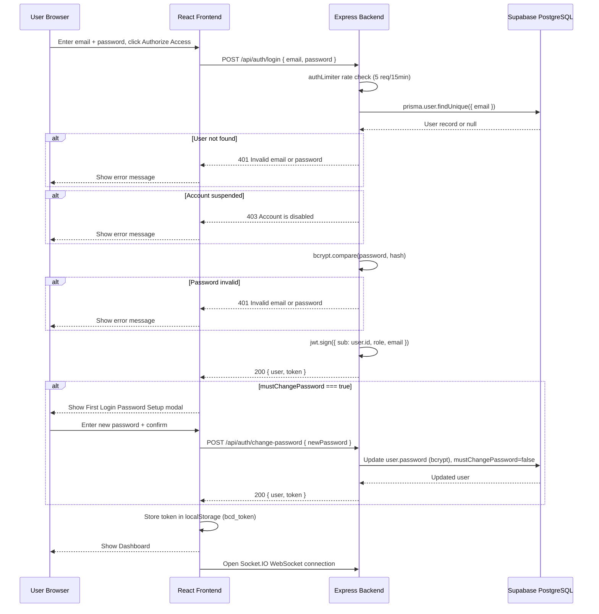
```mermaid
sequenceDiagram
    participant U as User Browser
    participant FE as React Frontend
    participant BE as Express Backend
    participant DB as Supabase PostgreSQL

    U->>FE: Enter email + password, click Authorize Access
    FE->>BE: POST /api/auth/login { email, password }
    BE->>BE: authLimiter rate check (5 req/15min)
    BE->>DB: prisma.user.findUnique({ email })
    DB-->>BE: User record or null
    alt User not found
        BE-->>FE: 401 Invalid email or password
        FE-->>U: Show error message
    end
    alt Account suspended
        BE-->>FE: 403 Account is disabled
        FE-->>U: Show error message
    end
    BE->>BE: bcrypt.compare(password, hash)
    alt Password invalid
        BE-->>FE: 401 Invalid email or password
        FE-->>U: Show error message
    end
    BE->>BE: jwt.sign({ sub: user.id, role, email })
    BE-->>FE: 200 { user, token }
    alt mustChangePassword === true
        FE-->>U: Show First Login Password Setup modal
        U->>FE: Enter new password + confirm
        FE->>BE: POST /api/auth/change-password { newPassword }
        BE->>DB: Update user.password (bcrypt), mustChangePassword=false
        DB-->>BE: Updated user
        BE-->>FE: 200 { user, token }
    end
    FE->>FE: Store token in localStorage (bcd_token)
    FE-->>U: Show Dashboard
    FE->>BE: Open Socket.IO WebSocket connection
```

### 13.2 Register Legal Document Sequence

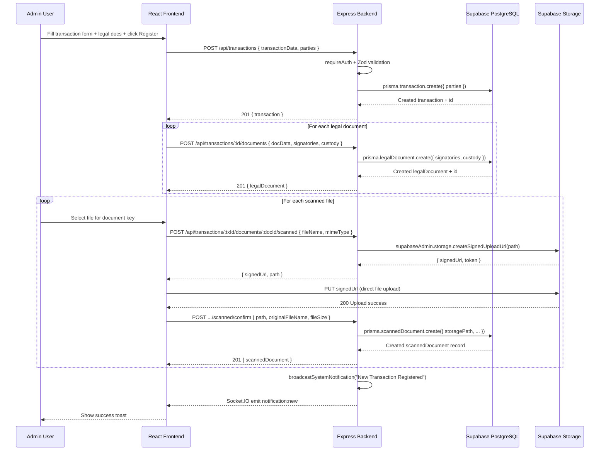
```mermaid
sequenceDiagram
    participant U as Admin User
    participant FE as React Frontend
    participant BE as Express Backend
    participant DB as Supabase PostgreSQL
    participant ST as Supabase Storage

    U->>FE: Fill transaction form + legal docs + click Register
    FE->>BE: POST /api/transactions { transactionData, parties }
    BE->>BE: requireAuth + Zod validation
    BE->>DB: prisma.transaction.create({ parties })
    DB-->>BE: Created transaction + id
    BE-->>FE: 201 { transaction }
    
    loop For each legal document
        FE->>BE: POST /api/transactions/:id/documents { docData, signatories, custody }
        BE->>DB: prisma.legalDocument.create({ signatories, custody })
        DB-->>BE: Created legalDocument + id
        BE-->>FE: 201 { legalDocument }
    end

    loop For each scanned file
        U->>FE: Select file for document key
        FE->>BE: POST /api/transactions/:txId/documents/:docId/scanned { fileName, mimeType }
        BE->>ST: supabaseAdmin.storage.createSignedUploadUrl(path)
        ST-->>BE: { signedUrl, token }
        BE-->>FE: { signedUrl, path }
        FE->>ST: PUT signedUrl (direct file upload)
        ST-->>FE: 200 Upload success
        FE->>BE: POST .../scanned/confirm { path, originalFileName, fileSize }
        BE->>DB: prisma.scannedDocument.create({ storagePath, ... })
        DB-->>BE: Created scannedDocument record
        BE-->>FE: 201 { scannedDocument }
    end

    BE->>BE: broadcastSystemNotification("New Transaction Registered")
    BE-->>FE: Socket.IO emit notification:new
    FE-->>U: Show success toast
```

### 13.3 Document Checkout Sequence

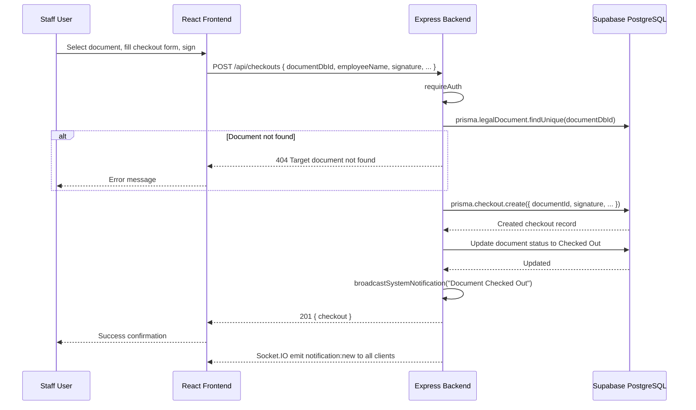
```mermaid
sequenceDiagram
    participant U as Staff User
    participant FE as React Frontend
    participant BE as Express Backend
    participant DB as Supabase PostgreSQL

    U->>FE: Select document, fill checkout form, sign
    FE->>BE: POST /api/checkouts { documentDbId, employeeName, signature, ... }
    BE->>BE: requireAuth
    BE->>DB: prisma.legalDocument.findUnique(documentDbId)
    alt Document not found
        BE-->>FE: 404 Target document not found
        FE-->>U: Error message
    end
    BE->>DB: prisma.checkout.create({ documentId, signature, ... })
    DB-->>BE: Created checkout record
    BE->>DB: Update document status to Checked Out
    DB-->>BE: Updated
    BE->>BE: broadcastSystemNotification("Document Checked Out")
    BE-->>FE: 201 { checkout }
    FE-->>U: Success confirmation
    BE-->>FE: Socket.IO emit notification:new to all clients
```

---

## 14. Activity Diagrams

### 14.1 Scanned Document Upload Activity

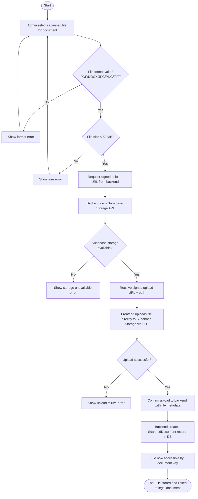
```mermaid
flowchart TD
    A([Start]) --> B[Admin selects scanned file for document]
    B --> C{File format valid?\nPDF/DOCX/JPG/PNG/TIFF}
    C -- No --> D[Show format error] --> B
    C -- Yes --> E{File size ≤ 50 MB?}
    E -- No --> F[Show size error] --> B
    E -- Yes --> G[Request signed upload URL from backend]
    G --> H[Backend calls Supabase Storage API]
    H --> I{Supabase storage\navailable?}
    I -- No --> J[Show storage unavailable error]
    I -- Yes --> K[Receive signed upload URL + path]
    K --> L[Frontend uploads file directly to Supabase Storage via PUT]
    L --> M{Upload successful?}
    M -- No --> N[Show upload failure error]
    M -- Yes --> O[Confirm upload to backend with file metadata]
    O --> P[Backend creates ScannedDocument record in DB]
    P --> Q[File now accessible by document key]
    Q --> R([End: File stored and linked to legal document])
```

### 14.2 Report Generation Activity

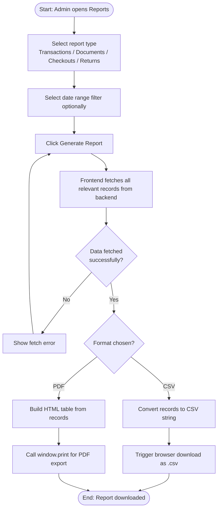
```mermaid
flowchart TD
    A([Start: Admin opens Reports]) --> B[Select report type\nTransactions / Documents / Checkouts / Returns]
    B --> C[Select date range filter optionally]
    C --> D[Click Generate Report]
    D --> E[Frontend fetches all relevant records from backend]
    E --> F{Data fetched\nsuccessfully?}
    F -- No --> G[Show fetch error] --> D
    F -- Yes --> H{Format chosen?}
    H -- CSV --> I[Convert records to CSV string]
    I --> J[Trigger browser download as .csv]
    H -- PDF --> K[Build HTML table from records]
    K --> L[Call window.print for PDF export]
    J --> M([End: Report downloaded])
    L --> M
```

---

## 15. State Diagrams

### 15.1 Legal Document Status States

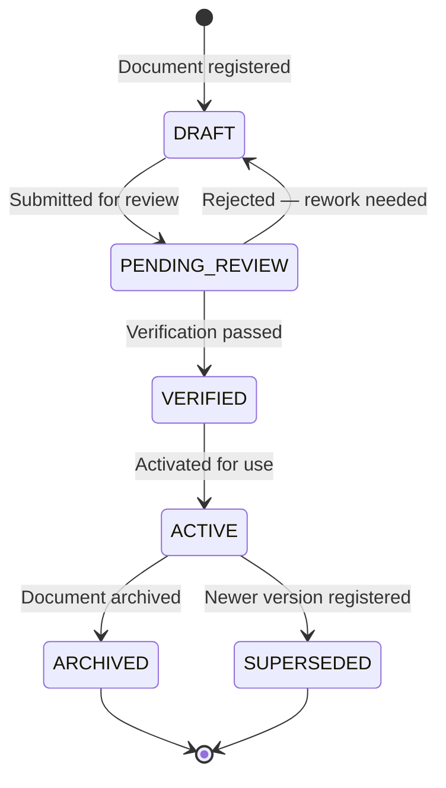
```mermaid
stateDiagram-v2
    [*] --> DRAFT : Document registered
    DRAFT --> PENDING_REVIEW : Submitted for review
    PENDING_REVIEW --> VERIFIED : Verification passed
    PENDING_REVIEW --> DRAFT : Rejected — rework needed
    VERIFIED --> ACTIVE : Activated for use
    ACTIVE --> ARCHIVED : Document archived
    ACTIVE --> SUPERSEDED : Newer version registered
    ARCHIVED --> [*]
    SUPERSEDED --> [*]
```

### 15.2 Transaction Status States

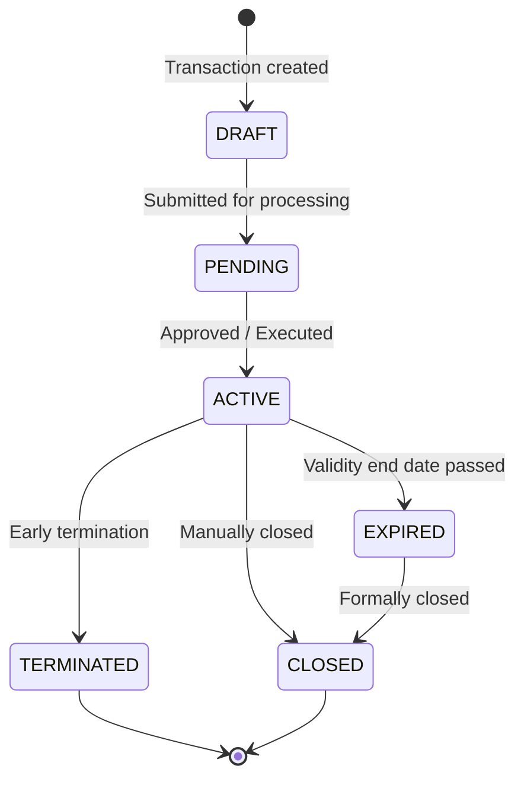
```mermaid
stateDiagram-v2
    [*] --> DRAFT : Transaction created
    DRAFT --> PENDING : Submitted for processing
    PENDING --> ACTIVE : Approved / Executed
    ACTIVE --> EXPIRED : Validity end date passed
    ACTIVE --> CLOSED : Manually closed
    ACTIVE --> TERMINATED : Early termination
    EXPIRED --> CLOSED : Formally closed
    TERMINATED --> [*]
    CLOSED --> [*]
```

### 15.3 Physical Document Custody States

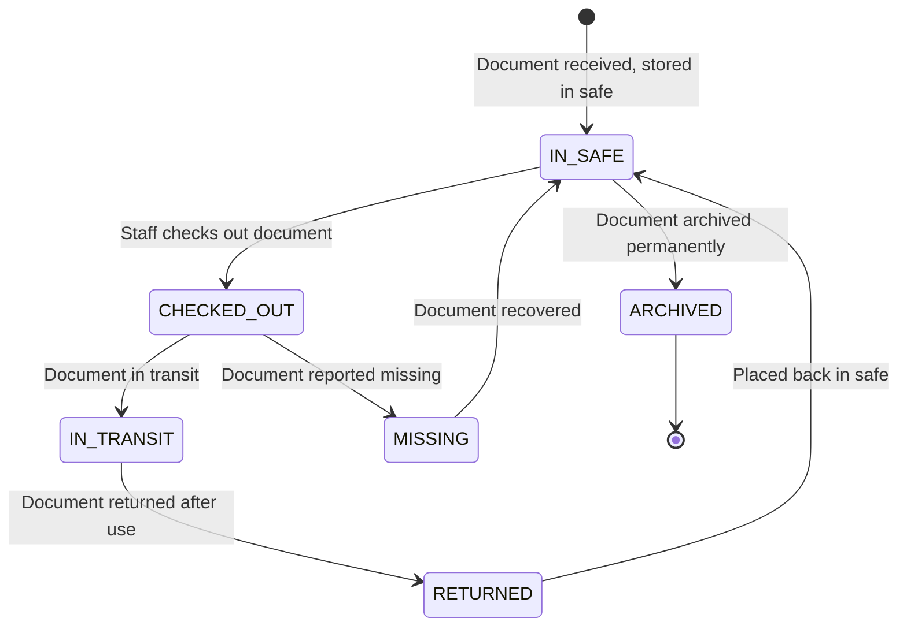
```mermaid
stateDiagram-v2
    [*] --> IN_SAFE : Document received, stored in safe
    IN_SAFE --> CHECKED_OUT : Staff checks out document
    CHECKED_OUT --> IN_TRANSIT : Document in transit
    IN_TRANSIT --> RETURNED : Document returned after use
    RETURNED --> IN_SAFE : Placed back in safe
    IN_SAFE --> ARCHIVED : Document archived permanently
    CHECKED_OUT --> MISSING : Document reported missing
    MISSING --> IN_SAFE : Document recovered
    ARCHIVED --> [*]
```

### 15.4 User Account States

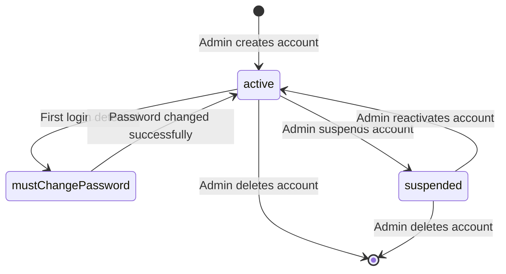
```mermaid
stateDiagram-v2
    [*] --> active : Admin creates account
    active --> mustChangePassword : First login detected
    mustChangePassword --> active : Password changed successfully
    active --> suspended : Admin suspends account
    suspended --> active : Admin reactivates account
    active --> [*] : Admin deletes account
    suspended --> [*] : Admin deletes account
```

---

## 16. Class Diagram

```mermaid
classDiagram
    class TransactionService {
        -transactionRepository: TransactionRepository
        +createTransaction(data, userId) Transaction
        +getTransactionDetails(id) Transaction
        +updateTransaction(id, data, userId) Transaction
        +deleteTransaction(id) void
        +addLegalDocument(txId, docData, userId) LegalDocument
        +uploadScannedDocument(txId, docId, fileData) SignedUploadUrl
        +confirmScannedDocument(txId, docId, metadata, userId) ScannedDocument
        +getSignedDownloadUrl(storagePath) string
        +deleteScannedDocument(txId, docId, fileId) void
    }

    class TransactionRepository {
        -prisma: PrismaClient
        +createTransaction(payload) Transaction
        +findTransactionById(id) Transaction
        +findTransactionByNumber(number) Transaction
        +listTransactions(filters) Transaction[]
        +updateTransaction(id, data) Transaction
        +deleteTransaction(id) void
        +addLegalDocument(txId, data) LegalDocument
        +updateCustody(docId, data) Custody
        +createScannedDocument(data) ScannedDocument
        +deleteScannedDocument(id) void
    }

    class StorageService {
        +generateSignedUploadUrl(bucket, path, expiresIn) SignedUploadUrl
        +generateSignedDownloadUrl(bucket, path, expiresIn) string
        +deleteObject(bucket, path) void
        +moveObject(bucket, fromPath, toPath) void
        +listObjects(bucket, prefix) Object[]
    }

    class AuthMiddleware {
        +requireAuth(req, res, next) void
        +requireRole(allowedRoles) Middleware
        +requirePermission(permission) Middleware
        +requireSession(req, res, next) void
    }

    class NotificationUtil {
        +broadcastSystemNotification(title, message) void
        +purgeExpiredNotifications() void
    }

    class User {
        +id: string
        +name: string
        +email: string
        +password: string
        +role: UserRole
        +status: UserStatus
        +designation: string
        +mustChangePassword: boolean
        +createdAt: datetime
    }

    class Transaction {
        +id: string
        +transactionNumber: string
        +transactionType: string
        +executionDate: datetime
        +transactionValue: float
        +currency: string
        +status: TransactionStatus
        +parties: Party[]
        +legalDocuments: LegalDocument[]
    }

    class LegalDocument {
        +id: string
        +transactionId: string
        +documentType: DocumentType
        +documentName: string
        +documentNumber: string
        +status: DocumentStatus
        +currentVersion: int
        +custody: Custody
        +signatories: Signatory[]
        +scannedDocuments: ScannedDocument[]
    }

    class ScannedDocument {
        +id: string
        +legalDocumentId: string
        +originalFileName: string
        +storagePath: string
        +mimeType: string
        +fileSize: int
        +verified: boolean
        +verificationStatus: VerificationStatus
    }

    class Custody {
        +id: string
        +legalDocumentId: string
        +custodianName: string
        +location: string
        +numberOfOriginalSets: int
        +originalAvailable: boolean
        +scannedAvailable: boolean
        +status: CustodyStatus
    }

    TransactionService --> TransactionRepository
    TransactionService --> StorageService
    TransactionService --> NotificationUtil
    TransactionRepository --> Transaction
    Transaction "1" --> "many" LegalDocument
    LegalDocument "1" --> "1" Custody
    LegalDocument "1" --> "many" ScannedDocument
    AuthMiddleware --> User
```

---

## 17. Data Flow Diagram (DFD)

### Level 0 — Context DFD

```mermaid
flowchart LR
    A["👤 Admin/Staff\nUser"] -- "Login credentials\nDocument data\nFile uploads\nCheckout requests" --> P1(("MITCON\nCredentia\nSystem"))
    P1 -- "Dashboard views\nDocument lists\nSigned download URLs\nReports\nNotifications" --> A

    P1 -- "SQL queries\nTransaction inserts" --> D1[("Supabase\nPostgreSQL")]
    D1 -- "Query results\nRecord sets" --> P1
    P1 -- "File upload\nFile download" --> D2[("Supabase\nStorage")]
    D2 -- "Signed URLs\nFile data" --> P1
```

### Level 1 — Main Processes DFD

```mermaid
flowchart TD
    USER["👤 User"]

    P1(("1.0\nAuthentication"))
    P2(("2.0\nTransaction\nManagement"))
    P3(("3.0\nFile\nStorage"))
    P4(("4.0\nCheckout &\nReturn"))
    P5(("5.0\nNotification\nBroadcast"))
    P6(("6.0\nReport\nGeneration"))

    DS1[("D1: User Store")]
    DS2[("D2: Transaction Store")]
    DS3[("D3: Supabase Storage")]
    DS4[("D4: Checkout Store")]
    DS5[("D5: Notification Store")]

    USER -- "Credentials" --> P1
    P1 -- "JWT Token" --> USER
    P1 -- "Lookup/Verify" --> DS1

    USER -- "Transaction data\nDocument data" --> P2
    P2 -- "Transaction records" --> DS2
    P2 -- "Upload request" --> P3
    P3 -- "Signed URL" --> USER
    USER -- "File bytes" --> DS3
    P3 -- "File metadata" --> DS2

    USER -- "Checkout form\nSignature" --> P4
    P4 -- "Checkout/Return records" --> DS4
    P4 -- "Event trigger" --> P5
    P5 -- "Notification record" --> DS5
    P5 -- "Real-time push" --> USER

    USER -- "Report request" --> P6
    DS2 -- "Report data" --> P6
    DS4 -- "Report data" --> P6
    P6 -- "CSV / PDF" --> USER
```

---

## 18. Security Architecture

```mermaid
graph TB
    subgraph Internet["Internet / Public"]
        ATTACKER["🎭 Potential Attacker"]
        USER_BROWSER["👤 Legitimate User Browser"]
    end

    subgraph PerimeterDefenses["Perimeter Defenses"]
        TLS["TLS 1.2+ Encryption\n(Vercel + Railway enforce HTTPS)"]
        RATE_LIMIT_AUTH["Auth Rate Limiter\n5 login attempts / 15 min / IP"]
        RATE_LIMIT_API["API Rate Limiter\n100 requests / 15 min / IP"]
    end

    subgraph AppDefenses["Application-Level Defenses"]
        HELMET["Helmet.js Security Headers\n• X-Frame-Options: DENY\n• X-XSS-Protection: 1; mode=block\n• Content-Security-Policy\n• Strict-Transport-Security\n• X-Content-Type-Options: nosniff"]
        CORS["CORS Policy\n• Restricted to registered origins only\n• Preflight OPTIONS handled"]
        JWT_VERIFY["JWT Verification\n• HS256 signed with JWT_SECRET\n• Expiry: 1h\n• Verified on every request\n• DB lookup confirms user still active"]
        RBAC["Role-Based Access Control\n• super-admin: full access\n• admin: create/manage\n• others: read + checkout\n• requireRole() on protected routes"]
        BCRYPT["Password Security\n• bcrypt 12 rounds\n• Passwords NEVER returned in API\n• mustChangePassword on first login"]
        ZOD["Input Validation\n• Zod schema on all request bodies\n• Type-safe validation\n• Prevents injection attacks"]
    end

    subgraph DataDefenses["Data Security"]
        SUPA_RLS["Supabase RLS\n• Row Level Security available\n• Recommended to enable post-handover"]
        SIGNED_URLS["Signed URLs\n• Upload: 5 min expiry\n• Download: 1 hour expiry\n• Time-limited access to files\n• No direct public bucket access"]
        SECRET_ROTATION["Secrets Management\n• All secrets in Railway env vars\n• Never committed to Git\n• Rotation recommended every 6 months"]
    end

    ATTACKER -- "HTTPS only" --> TLS
    USER_BROWSER -- "HTTPS only" --> TLS
    TLS --> RATE_LIMIT_AUTH & RATE_LIMIT_API
    RATE_LIMIT_AUTH & RATE_LIMIT_API --> HELMET --> CORS --> JWT_VERIFY --> RBAC --> ZOD --> BCRYPT & SUPA_RLS & SIGNED_URLS --> SECRET_ROTATION
```

---

## 19. Wireframes

### 19.1 Login Screen

```
┌─────────────────────────────────────────────────────┐
│                                                     │
│           [ MITCON CREDENTIA LOGO ]                 │
│                                                     │
│         Secure Core Repository                      │
│              Module Tracker                         │
│                                                     │
│  ┌───────────────────────────────────────────────┐  │
│  │  ✉ Organizational Work Email                  │  │
│  │  [ name@mitconindia.com                    ]  │  │
│  │                                               │  │
│  │  🔑 Account Passcode                          │  │
│  │  [ ••••••••••••••••                        ]  │  │
│  │                                               │  │
│  │  [ AUTHORIZE ACCESS →                      ]  │  │
│  └───────────────────────────────────────────────┘  │
│                                                     │
└─────────────────────────────────────────────────────┘

First Login Modal (Overlay):
┌─────────────────────────────────────────┐
│  🔑 First Login Password Setup          │
│  ─────────────────────────────────────  │
│  Welcome [Name]! Set your permanent     │
│  account password.                      │
│                                         │
│  New Password                           │
│  [ ••••••••••••••••••••               ] │
│  Confirm Password                       │
│  [ ••••••••••••••••••••               ] │
│                                         │
│  [ SET PASSWORD & ENTER REPOSITORY ]    │
└─────────────────────────────────────────┘
```

### 19.2 Dashboard

```
┌──────────────────────────────────────────────────────────────┐
│  🏛 MITCON Credentia          [🔔 Bell]  [👤 User Menu]       │
│  ─────────────────────────────────────────────────────────── │
│  [Dashboard] [Legal Doc Mgr] [Checkout] [Reports] [Users]    │
├──────────────────────────────────────────────────────────────┤
│                                                              │
│  ┌──────────┐  ┌──────────┐  ┌──────────┐  ┌──────────┐    │
│  │  Total   │  │  Active  │  │ Checked  │  │ Returns  │    │
│  │Transact. │  │Documents │  │   Out    │  │  Today   │    │
│  │   42     │  │   187    │  │    8     │  │    3     │    │
│  └──────────┘  └──────────┘  └──────────┘  └──────────┘    │
│                                                              │
│  Recent Legal Documents         Recent Checkouts            │
│  ┌─────────────────────────┐   ┌─────────────────────────┐  │
│  │ TX-001 | Loan Agmt...   │   │ CHK-001 | PIP | NAME 1  │  │
│  │ TX-002 | Mortgage...    │   │ CHK-002 | SIP | NAME 2  │  │
│  │ TX-003 | Guarantee...   │   │ CHK-003 | MOD | NAME 3  │  │
│  └─────────────────────────┘   └─────────────────────────┘  │
└──────────────────────────────────────────────────────────────┘
```

### 19.3 Legal Document Manager

```
┌──────────────────────────────────────────────────────────────┐
│  📁 Legal Document Manager                                   │
│  ─────────────────────────────────────────────────────────── │
│  [🔍 Search transactions...]  [Filter ▼]  [+ Register New]   │
├──────────────────────────────────────────────────────────────┤
│  TX-001  |  Loan Agreement  |  Borrower: ABC Ltd  | ACTIVE   │
│  ├─ Promissory Note     | IN_SAFE   | 📄 Scanned  [View]     │
│  └─ Pledge Agreement    | IN_SAFE   | 📄 Scanned  [View]     │
│  ──────────────────────────────────────────────────────────  │
│  TX-002  |  Mortgage Deed   |  Borrower: XYZ Co  | ACTIVE    │
│  └─ Mortgage Deed       | CHECKED_OUT | 📄 Scanned [View]    │
├──────────────────────────────────────────────────────────────┤
│  Register New Transaction Form (Drawer/Modal):               │
│  ┌────────────────────────────────────────────────────────┐  │
│  │ Section 1: Transaction Details                         │  │
│  │ Section 2: Client Information (Parties)                │  │
│  │ Section 3: Legal Documents (+ Add Another Document)    │  │
│  │ Section 4: Signatories                                 │  │
│  │ Section 5: Physical Custody                            │  │
│  │ Section 6: Scanned Copies Upload (per doc key)         │  │
│  │ [ REGISTER TRANSACTION ]                               │  │
│  └────────────────────────────────────────────────────────┘  │
└──────────────────────────────────────────────────────────────┘
```

### 19.4 User Management Panel

```
┌──────────────────────────────────────────────────────────────┐
│  👤 User Management                                          │
├──────────────────────────────────────────────────────────────┤
│  Name          | Email                | Role    | Status     │
│  NAME 1        | name1@mitcon...      | S-Admin | Active     │
│  NAME 2        | name2@mitcon...      | Admin   | Active ✏️🗑 │
│  NAME 3        | name3@mitcon...      | Others  | Active ✏️🗑 │
├──────────────────────────────────────────────────────────────┤
│  + Create Organizational Account                             │
│  ┌──────┬──────────────┬────────┬─────────────┬──────────┐  │
│  │ Name │ Email        │ Role   │ Designation │ Passcode │  │
│  └──────┴──────────────┴────────┴─────────────┴──────────┘  │
│  [ Generate User Account ]                                   │
│                                                              │
│  ✅ Account generated!                                       │
│  Temporary Passcode: [Mitcon@4821]  (Share with new user)   │
└──────────────────────────────────────────────────────────────┘
```

---

## 20. UI Flow

```mermaid
flowchart TD
    START([User opens Credentia URL]) --> LOGIN[Login Page]
    LOGIN --> AUTH{Authentication\nResult}
    AUTH -- Invalid Credentials --> LOGIN
    AUTH -- mustChangePassword --> CHGPWD[First Login Password Setup Modal]
    CHGPWD --> DASHBOARD
    AUTH -- Valid JWT --> DASHBOARD[Dashboard]

    DASHBOARD --> NAV{User selects navigation}

    NAV -- Legal Docs --> LDM[Legal Document Manager]
    LDM --> LDM_LIST[View Transaction List]
    LDM_LIST --> LDM_DETAIL[Open Transaction Detail Modal]
    LDM_DETAIL --> LDM_SCANNED[View / Download Scanned Copy per Document]
    LDM --> LDM_REGISTER[Register New Transaction Form]
    LDM_REGISTER --> LDM_SEC1[Section 1: Transaction Details]
    LDM_SEC1 --> LDM_SEC2[Section 2: Parties]
    LDM_SEC2 --> LDM_SEC3["Section 3: Legal Documents\n(+ Add Another Document)"]
    LDM_SEC3 --> LDM_SEC4[Section 4: Signatories]
    LDM_SEC4 --> LDM_SEC5[Section 5: Physical Custody]
    LDM_SEC5 --> LDM_SEC6[Section 6: Scanned Copies Upload]
    LDM_SEC6 --> LDM_SUBMIT[Submit Transaction]
    LDM_SUBMIT --> SUCCESS1[✅ Transaction Registered]

    NAV -- Checkout --> CHKOUT[Checkout & Return Module]
    CHKOUT --> CHKOUT_FORM[Fill Checkout Form]
    CHKOUT_FORM --> SIG[Digital Signature Capture\nDrawn / Upload / Typed]
    SIG --> CHKOUT_SUBMIT[Submit Checkout]
    CHKOUT_SUBMIT --> SUCCESS2[✅ Checkout Created]
    CHKOUT --> RETURN_FORM[Fill Return Form]
    RETURN_FORM --> RETURN_SUBMIT[Submit Return]
    RETURN_SUBMIT --> SUCCESS3[✅ Return Recorded]

    NAV -- Reports --> REPORT[Report Module]
    REPORT --> REPORT_TYPE{Select Type}
    REPORT_TYPE -- Transactions --> RPT_CSV[CSV Download]
    REPORT_TYPE -- Documents --> RPT_PDF[PDF Export]
    REPORT_TYPE -- Checkouts --> RPT_CSV
    REPORT_TYPE -- Returns --> RPT_PDF

    NAV -- Users --> USERS[User Management Panel]
    USERS --> USER_LIST[View Users List]
    USERS --> CREATE_USER[Create New Account Form]
    CREATE_USER --> CREATE_SUBMIT[Submit → Show Temp Passcode]
    USERS --> POLICY[Security Policy Configuration]

    NAV -- Notifications --> NOTIF[Notification Center Panel]
    NOTIF --> MARK_READ[Mark as Read]
```

---

## 21. Folder Structure

```
MITCON-CREDENTIA/                         ← Monorepo root
├── .agents/
│   └── AGENTS.md                         ← Project coding rules
├── .gitignore                            ← Excludes node_modules, .env, dist
├── package.json                          ← Root monorepo scripts (dev, build, test)
├── README.md                             ← Complete master project readme
│
├── backend/                              ← Node.js Express API
│   ├── prisma/
│   │   ├── schema.prisma                 ← Full database schema definition
│   │   └── migrations/                   ← Prisma migration history
│   ├── src/
│   │   ├── server.js                     ← Entry point — bootstrap, socket, graceful shutdown
│   │   ├── app.js                        ← Express app — middleware chain + route mounts
│   │   ├── auth/
│   │   │   └── auth.routes.js            ← Login, change-password, logout, /me
│   │   ├── config/
│   │   │   ├── env.js                    ← Zod-validated environment configuration
│   │   │   ├── database.js               ← Prisma client singleton
│   │   │   ├── supabase.js               ← Supabase Admin SDK client
│   │   │   └── socket.js                 ← Socket.IO server
│   │   ├── middleware/
│   │   │   ├── auth.middleware.js        ← requireAuth, requireRole, requirePermission
│   │   │   └── rateLimit.middleware.js   ← apiLimiter, authLimiter
│   │   ├── routes/
│   │   │   ├── transaction.routes.js    ← Transactions, parties, legal docs, scanned
│   │   │   ├── documents.routes.js      ← Legacy vault document CRUD
│   │   │   ├── checkout.routes.js       ← Checkout + Return endpoints
│   │   │   ├── security.routes.js       ← User CRUD + Security policy
│   │   │   ├── notification.routes.js   ← Notification fetch/read/clear
│   │   │   └── backup.routes.js         ← Full backup export
│   │   ├── services/
│   │   │   ├── transaction.service.js   ← Core transaction business logic
│   │   │   └── storage/
│   │   │       └── storage.service.js   ← Supabase Storage abstraction layer
│   │   ├── repositories/
│   │   │   └── transaction.repository.js← All Prisma queries for transactions
│   │   └── utils/
│   │       └── notification.util.js     ← broadcastSystemNotification, auto-purge
│   └── package.json                     ← Backend dependencies + start/build scripts
│
└── frontend/                            ← React TypeScript SPA
    ├── dist/                            ← Production build output (Vercel serves this)
    ├── src/
    │   ├── main.tsx                     ← Vite entry point
    │   ├── App.tsx                      ← Root component: auth state, socket, routing
    │   ├── types.ts                     ← All TypeScript interfaces and enums
    │   └── components/
    │       ├── LoginPage.tsx            ← Login + first-login password change
    │       ├── Dashboard.tsx            ← Stats overview + recent records
    │       ├── LegalDocumentManager.tsx ← Main legal doc registration + management
    │       ├── CheckoutReturn.tsx       ← Checkout + return workflow with signatures
    │       ├── ReportModule.tsx         ← CSV and PDF report generation
    │       ├── UserManager.tsx          ← User CRUD + security policy management
    │       ├── NotificationCenter.tsx   ← Real-time notification panel
    │       ├── SignatureCanvas.tsx      ← Digital signature capture component
    │       └── ToastNotificationContainer.tsx
    └── package.json                     ← Frontend dependencies + dev/build scripts
```

---

## 22. User Roles & Access Control

| Role | Badge | Permissions |
|---|---|---|
| `super-admin` | 🔴 Full System Access | Create/delete users, configure security policy, export DB backup, all read/write |
| `admin` | 🟡 Administrative Access | Create users, register & manage transactions, legal documents, checkouts, returns |
| `others` | 🟢 Standard Staff | Read transactions/documents, check out physical documents, record returns, view reports |

---

## 23. Authentication & First-Time Login

### Normal Login Flow
1. Submit email + password → `POST /api/auth/login`
2. Backend verifies bcrypt hash (12 rounds)
3. If `mustChangePassword === true` → First Login Password Setup Modal appears
4. If `mustChangePassword === false` → Return JWT token (1h expiry)
5. Frontend stores JWT in `localStorage` as `bcd_token`
6. All API calls include `Authorization: Bearer <token>`

### First-Time User Login Procedure
1. **Admin Steps**: Log in → User Management tab → fill user details → click **Generate User Account**. A green banner displays the **Temporary Passcode** (`Mitcon@XXXX`). Share this with the user securely.
2. **New User Steps**: Open MITCON Credentia URL → enter email + temporary passcode → click **Authorize Access**. The mandatory **First Login Password Setup** modal appears. Set a permanent password (min 8 chars) → click **Set Password & Enter Repository**.

---

## 24. File Storage System

| Parameter | Value |
|---|---|
| Provider | Supabase Storage |
| Storage Bucket | `documents` |
| Max File Size | **50 MB** |
| Supported Formats | PDF, DOCX, DOC, XLSX, JPG, JPEG, PNG, WEBP, TIFF |
| Upload Method | Direct client upload via **Supabase signed URL** (PUT) |
| Download Method | Time-limited **signed URLs** (1 hour expiry) |
| Storage Path Format | `scanned/{transactionId}/{documentId}/{timestamp}_{uuid}_{filename}` |

---

## 25. Real-Time Notification System

| Parameter | Detail |
|---|---|
| Library | Socket.IO 4.x |
| Transport | WebSocket with long-polling fallback |
| Emitted Event | `notification:new` |
| Auto-Purge | Notifications older than **30 minutes** auto-deleted from DB on startup and every 2 minutes |

Events broadcasting push notifications:
- New user account created
- New transaction registered
- Document checked out / returned
- Security policy updated

---

## 26. Local Development Setup

### Prerequisites
- Node.js v18+, npm v9+
- Supabase project with PostgreSQL and Storage bucket (`documents`)
- Configured `.env` file in `backend/`

```bash
# 1. Clone repository
git clone <repository-url>
cd MITCON-CREDENTIA

# 2. Install dependencies
npm install
cd backend && npm install && cd ..
cd frontend && npm install --legacy-peer-deps && cd ..

# 3. Run Prisma database migrations
cd backend && npx prisma migrate deploy && cd ..

# 4. Start both servers concurrently
npm run dev
# Frontend: http://localhost:5173
# Backend:  http://localhost:5000
# Health:   http://localhost:5000/health
```

---

## 27. Environment Variables Reference

All environment variables must be configured in Railway (backend). **Never commit real credentials to Git.**

```env
DATABASE_URL=postgresql://...?pgbouncer=true&connection_limit=1
DIRECT_URL=postgresql://...
SUPABASE_URL=https://xxxxxxxx.supabase.co
SUPABASE_SERVICE_ROLE_KEY=eyJhbGci...
SUPABASE_ANON_KEY=eyJhbGci...
SUPABASE_BUCKET=documents
JWT_SECRET=your-super-long-random-secret-key-32-chars-minimum
JWT_EXPIRY=1h
REFRESH_SECRET=another-long-random-refresh-secret
SESSION_SECRET=session-signing-secret
NODE_ENV=production
PORT=5000
CORS_ORIGINS=https://your-app.vercel.app
RATE_LIMIT_WINDOW=15
RATE_LIMIT_MAX=100
REDIS_ENABLED=false
```

---

## 28. Deployment Procedures

### Production Deployment (CI/CD)

Both Vercel (frontend) and Railway (backend) auto-deploy on every `git push` to `main`:

```bash
git add .
git commit -m "feat: describe changes"
git push origin main
```

### Database Schema Migrations

```bash
cd backend
npx prisma migrate deploy
```

---

## 29. Potential Risk Factors

| # | Level | Risk | Mitigation |
|---|---|---|---|
| R1 | 🔴 High | **JWT Secret Exposure** | Rotate `JWT_SECRET` in Railway immediately if compromised. |
| R2 | 🔴 High | **Supabase Service Role Key Exposure** | Store strictly in Railway env vars. Monitor Supabase audit logs. |
| R3 | 🔴 High | **No Email Password Reset** | Always maintain 2+ active Super-Admin accounts. |
| R4 | 🔴 High | **Single Admin Lock-Out** | Maintain minimum 2 active Super-Admin accounts at all times. |
| R5 | 🟡 Medium | **Railway Cold Starts (502)** | Upgrade to paid Railway plan or set up UptimeRobot ping on `/health`. |
| R6 | 🟡 Medium | **Supabase Storage Quota** | Monitor Supabase dashboard and upgrade plan when nearing 1 GB. |
| R7 | 🟡 Medium | **JWT in localStorage** | Sanitize inputs; consider `httpOnly` cookie migration in future. |
| R8 | 🟢 Low | **Orphaned Storage Files** | Periodically audit Supabase Storage bucket. |
| R9 | 🟢 Low | **No Automated Backup Schedule** | Enable Supabase automated daily backups. |

---

## 30. Developer Disclaimer & Declaration

### Developer Declaration of Confidentiality & Liability

**Project:** MITCON Credentia — Legal Document Management System   
**Date:** 30 July 2026  

**I, Developer, hereby formally declare and confirm the following:**

1. **No Confidential Data Accessed or Handled**: Throughout the entire duration of this project — from design to handover — **no confidential, sensitive, proprietary, or private documents or data belonging to MITCON Consultancy & Engineering Services Ltd., its clients, borrowers, or lenders have been accessed, viewed, downloaded, retained, copied, or stored by the Developer**.
2. **No Unauthorized Database Access**: No data has been inserted or modified in the production database by the Developer without explicit authorization. Schema migration was executed using standard Prisma tooling creating empty structures only.
3. **Liability Disclaimer**: As explicitly agreed prior to project initiation and at handover, the Developer accepts **no liability, responsibility, or accountability** for data loss, data breaches, system downtime by third-party hosting providers (Vercel, Railway, Supabase), weak passwords chosen by staff, or post-handover operation.
4. **Scope of Developer Responsibility**: Limited strictly to delivering functional software source code as scoped. Ongoing maintenance or regulatory compliance post-handover remains the responsibility of MITCON.
5. **Credentials**: The Developer retains no production secrets, credentials, or admin access post-handover. MITCON is advised to rotate all secrets in Railway environment variables immediately.

---

<div align="center">

**MITCON Credentia** — Built for MITCON Consultancy & Engineering Services Ltd.

*Production-deployed on Vercel + Railway + Supabase*

</div>
